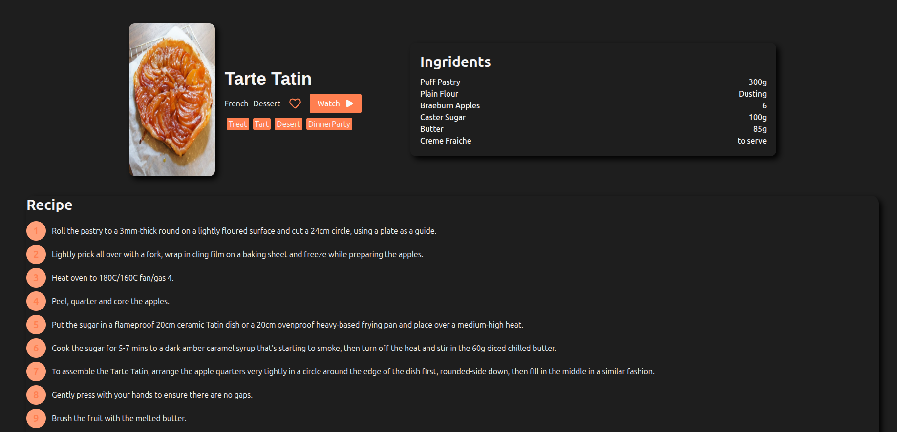
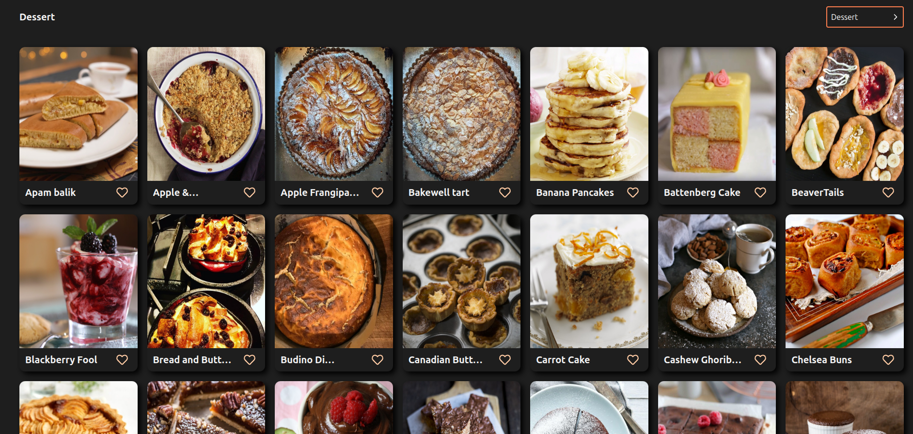
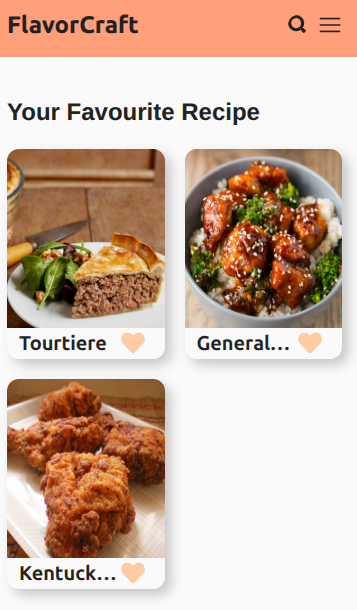

# Recipe App

A simple, user-friendly web application that allows users to browse, search, and manage delicious recipes.

---

## Features

- Browse a variety of recipes with images and detailed instructions  
- Search recipes by ingredients, cuisine, or recipe name  
- Save favorite recipes for quick access  
- Responsive design for mobile and desktop devices  
- User authentication

---

## Screenshots





---

## Technologies Used

- React
- CSS / Tailwind CSS   

---

## Installation

1. Clone the repository  
   ```bash
   git clone https://github.com/sujan17148/recipe-app.git
